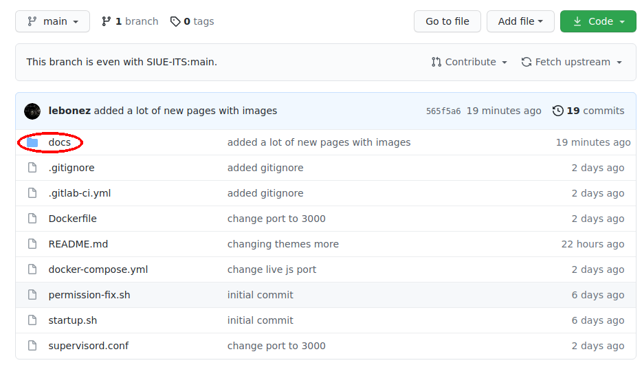
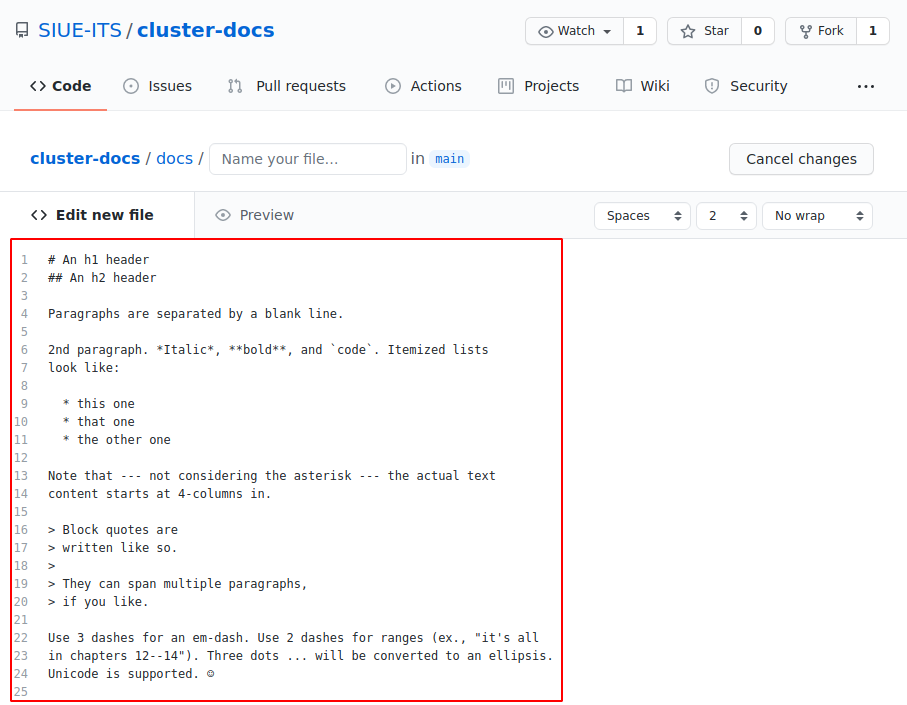
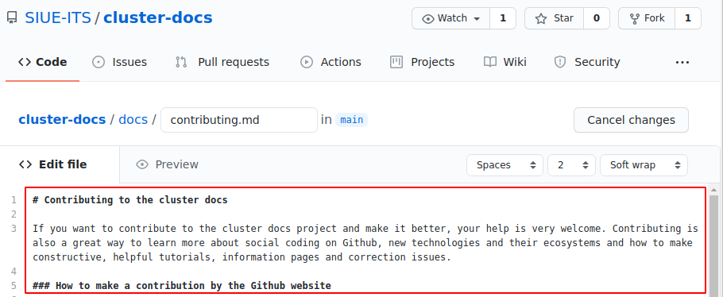
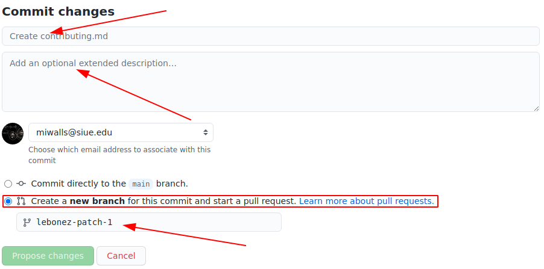
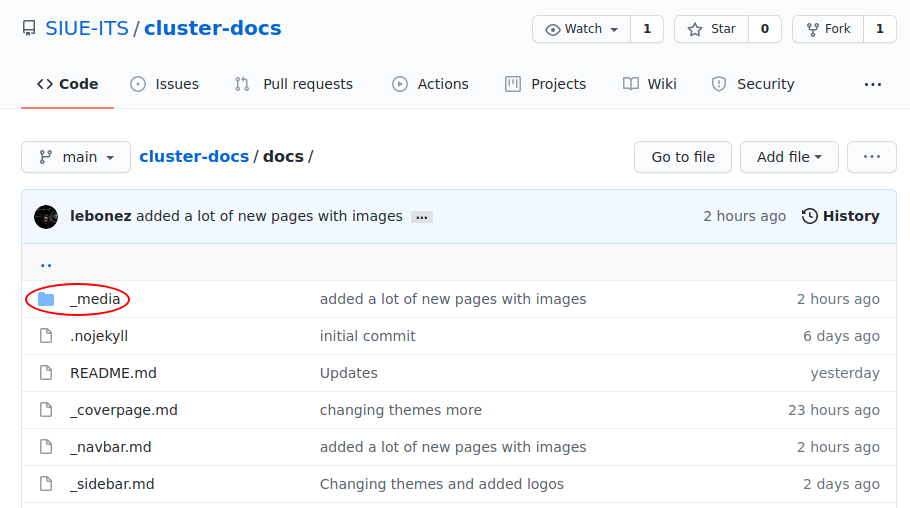

### How to make a contribution using the Github website {docsify-ignore}

Open a web browser and navigate to [cluster-docs](https://github.com/SIUE-ITS/cluster-docs) repo.

Start by going to the docs folder.

### Add a file.

Name the file:

Add content to the file editing with [markdown](https://www.markdownguide.org/basic-syntax/):

?> A good template is the [`getting_started.md`](https://raw.githubusercontent.com/SIUE-ITS/cluster-docs/main/docs/user_guides/hpc_basics/getting_started.md) file. It contains an example of almost everything with proper formatting. Do not concern yourself with formatting in major detail content matters most. The maintainers will work on this to match the rest of the site when merged.

The final step is to commit and start a pull request. Add a name to the commit, an optional description, and a branch name for the pull request. Then finally click `Propose new file`:

### Edit a file.

Edit a file by clicking the file you would like to edit (in this example the contributing page):

?> You can also go directly to the page itself such as [getting_started.md](user_guides/hpc_basics/getting_started.md) then click `Edit on git` at the top right of the page.

Click the pencil to edit the file:

Once you are in the file you will edit with [markdown](https://www.markdownguide.org/basic-syntax/):

?> Do not concern yourself with formatting in major detail content matters most. The maintainers will work on this to match the rest of the site when merged.

Once done making edits give the commit a name, optional description, and a branch name then click propose changes:

### Upload images (or other files).
If your new content page or edit requires embedding images (or other files) you will want to upload the files to the `docs/_media` directory:

Now click `Add file`->`Upload Files`:

Once in there you will start by clicking `choose your files`. This will open your file browser. Browse to the file(s). If multiple `ctrl + click` each file you'd like to upload. Give the commit a name, optional description, and new branch name. Then click `Propose changes`:

?> You will want to name the file a relevant name for ease of use in the future before uploading.

### Additional help or info
- Contact its-cluster-support@siue.edu for help with contributing.
- A lot of documentation exists online for using Github it is recommended reading especially if you'd like to edit the cluster-docs repo locally.
