# Transferring Files Using Globus

Globus provides a relatively simple and reliable way to access and move research data between systems with faster transfer speeds than tools such as sftp, scp, and rsync. Globus requires some setup ahead of time, but it is robust and appropriate when your data transfer will take a long time or your connection may be periodically interrupted. It also allows you to share your data with colleagues, move data back and forth between SIUE storage systems and personal workstations, and restart or resume a failed or paused file transfer — even a very large one.

### Getting started with Globus

To start using Globus, go to https://www.globus.org in your browser and click Log In near the top of the screen. On the next page, you will need to login with a Google or Globus ID account.

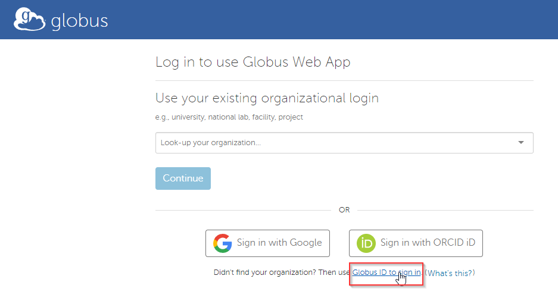

Next you should get the Globus ID login page. At this point if you already have a Globus ID and password go ahead and login if you not click 'Need a Globus ID? Sign Up'.

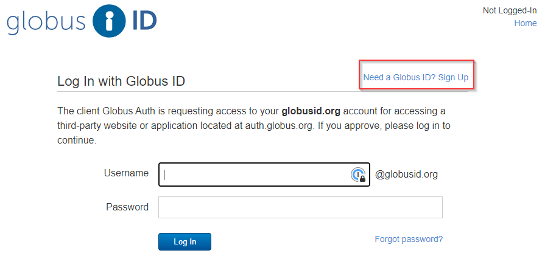

If creating an account fill out the information as show in image below and verify your account by going to your SIUE email.

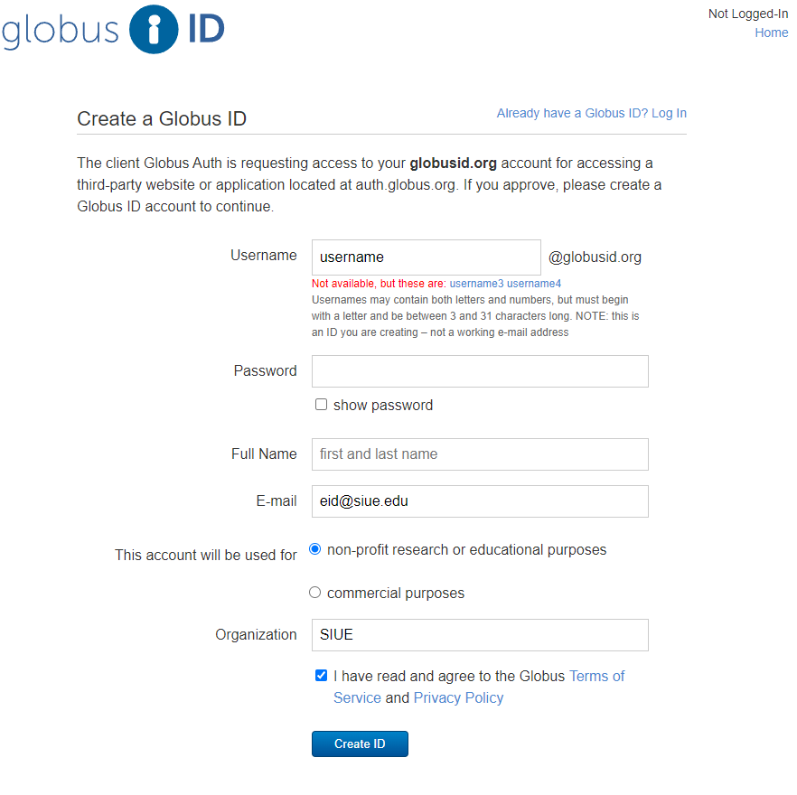

Go back to the login page once you have created your account and use the Globus ID and password that you set before.

After authenticating you'll land on the File Manager page.

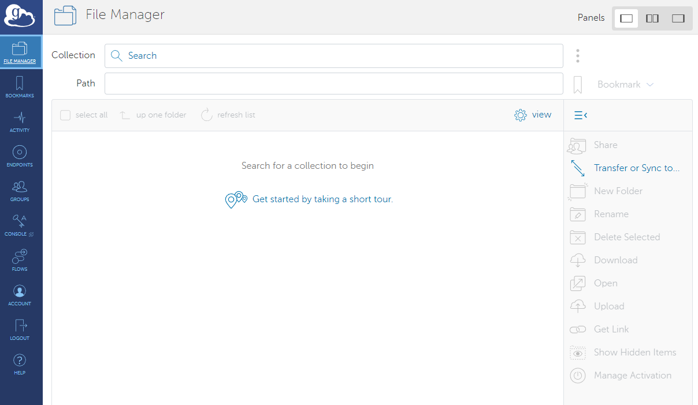

You can toggle the number and configuration of the two panes using the Panels menu in the top right of the File Manager page.

### Setting up Collections for file transfers

In Globus terminology, a user sets up a **Collection**, which is simply a place to transfer files. This can be a folder on your laptop, your home directory on a remote data transfer node (like SIUE's dtn.hpc.siue.edu), or even a remote location you have access to through a scientific computing affiliation.

In the Globus user interface, Collections are managed in terms of **Endpoints**. From the main Globus File Manager page, click on the **ENDPOINTS** link on the left panel.

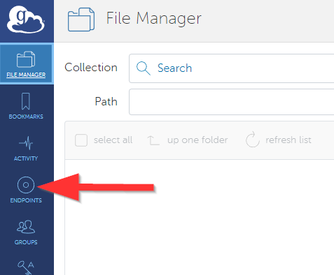

On the upper right of the File Manager page, click on **Create a personal endpoint**.

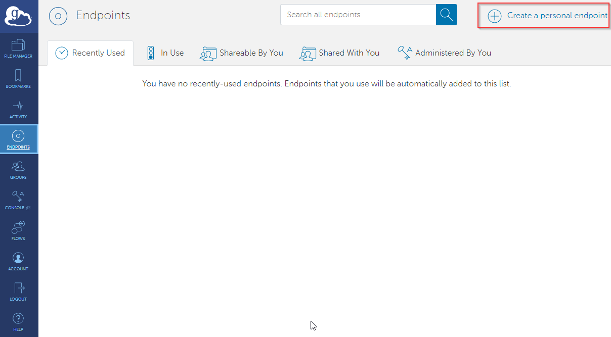

#### Installing Globus Connect Personal

You'll be presented with a link to download and install the desktop service, Globus Connect Personal, that makes Globus work behind the scenes for you.

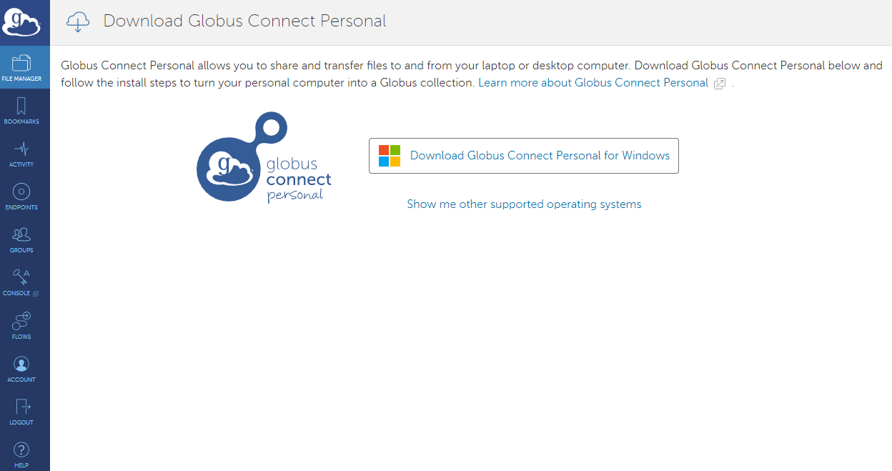

Running it will take you through the standard software installation process for your platform. Go ahead and start the Globus service on your computer.

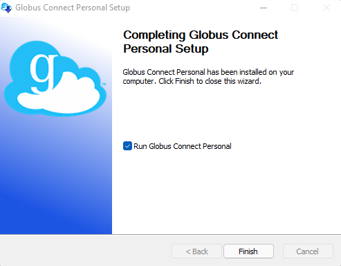

A new window will pop up asking you to log in again.

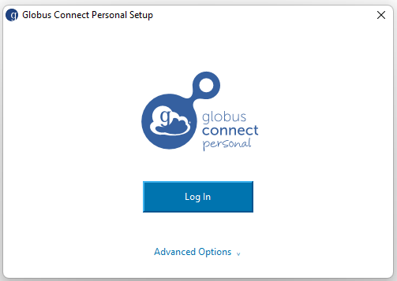

Once logged in, allow the setup to continue.

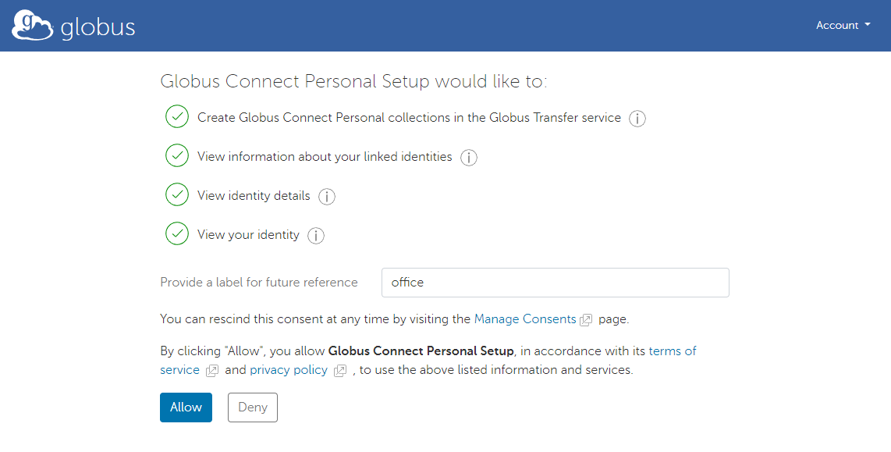

#### Globus Installation Guides

* [How to Install: Mac OS](https://docs.globus.org/how-to/globus-connect-personal-mac/)
* [How to Install: Windows](https://docs.globus.org/how-to/globus-connect-personal-windows/)
* [How to Install: Linux](https://docs.globus.org/how-to/globus-connect-personal-linux/)

#### Establishing an endpoint

You can now establish an Endpoint on your PC - Globus wants to call it a Collection. Under **Collection Name**, choose a descriptive name. Do not choose the High Assurance option - that feature is beyond the scope of this document.

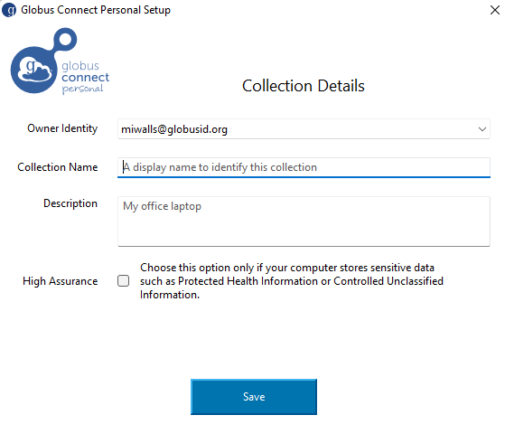

Depending on whether Globus knows your account ID from a previous login or existing affiliation, you may be asked to generate a setup key for your collection. Copy it to the clipboard of your computer. Keep this key if you are asked for it during the next one or two steps.

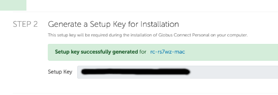

In the setup window, clicking **Save** will open yet another Globus front end interface. Click on **ENDPOINTS** and then on **Administered by You** on the right side of the middle menu. You should see the Endpoint you entered previously.

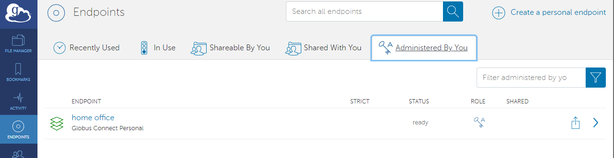

Click on the Endpoint and in the next screen, choose the **Open in File Manager** button on the right hand side of the page.

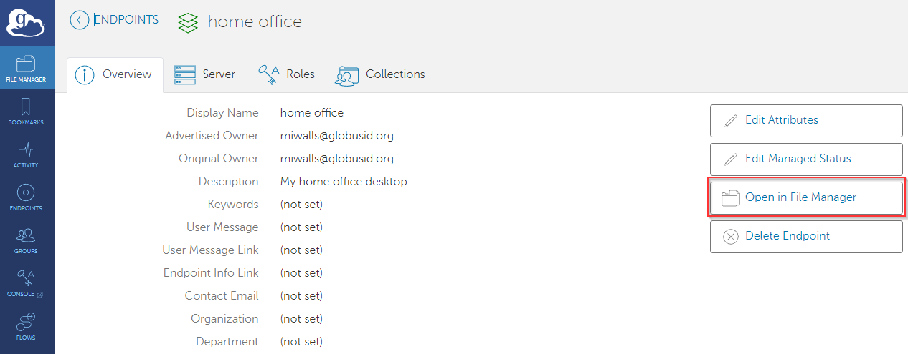

Ensure that this takes you to a listing of the files in the selected directory on your computer, including subfolders into which you can navigate.

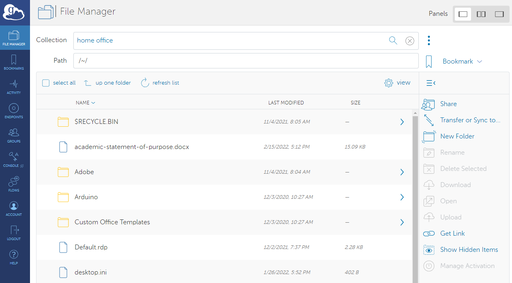

#### Allowing access to your local files

For security, Globus requires you to specifically allow files and folders on your computer to be shared or transferred.

On Windows, to allow a folder's contents to be transferred, right click on the small **g** (the Globus icon) in your running task icons in the task bar.

Select the **Options...** menu item.

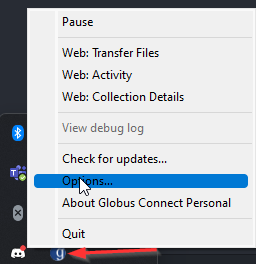

You will be presented with a box to add a folder containing the files you want to transfer. If you click on the **+** sign on the lower right (highlighted in blue) you will have a standard file explorer that gives you the ability to add a folder on your local hard drive. For now, only keep the **Writable** option checked and the **Shareable** option unchecked.

Click the **Save** button to continue.

On a Mac, the process is similar. You access the small Globus **g** icon in the top menu bar and choose **Preferences...** and then the **Access** tab.

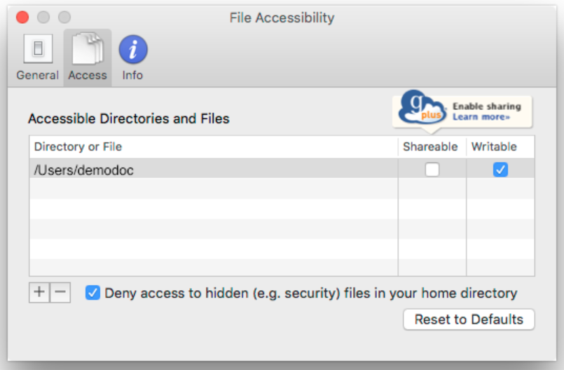

### Setting up access to your SIUE directories

To set up access to your SIUE `/home`, `/project`, and `/bulk` directories on the campus cluster, go to **ENDPOINTS** and click on **Shared with You** in the middle menu bar. Right above that, enter **SIUE ITS Cyberinfrastructure** in the search box and click the magnifying glass. The data transfer node endpoint should appear in the main window.

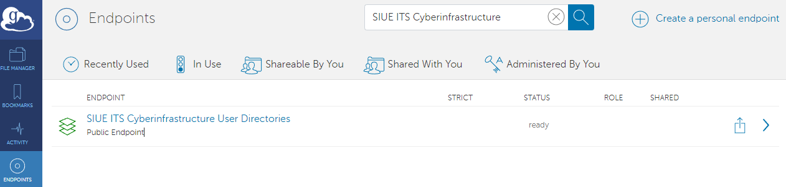

After selecting the **SIUE ITS Cyberinfrastructure User Directories** endpoint, you will be taken to the Endpoint's main page.

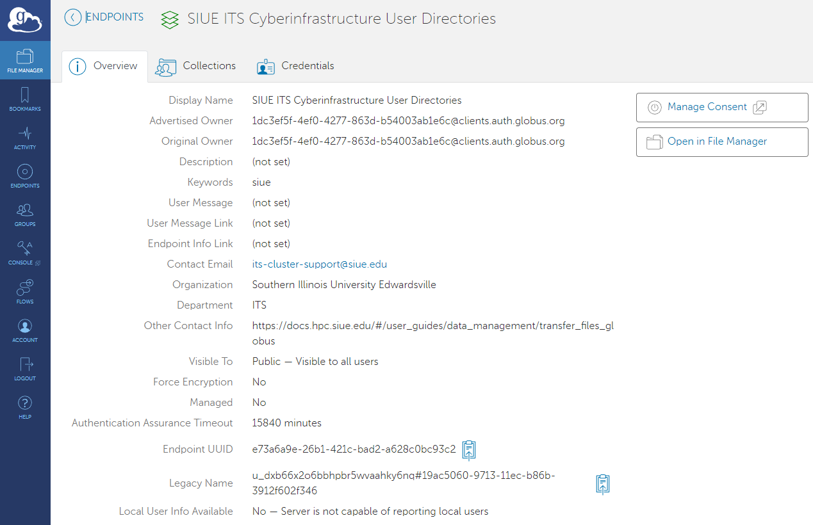

Navigate to the Credentials tab and you will see that authentication and consent are required for Globus to manage collections on the Endpoint. Click **Continue**.

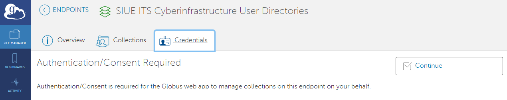

You will be asked to select your login click the option highlighted in box to login using your SIUE e-ID and password. You might also be asked to login into Globus with your ID.

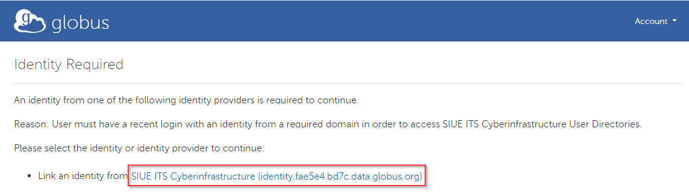

At this point you will see another login page where you are asked for your SIUE e-ID and password.

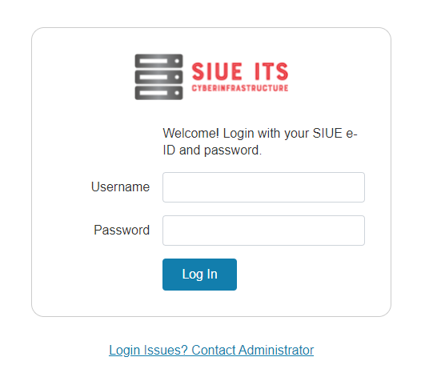

You will then need to grant Globus a list of permissions by clicking **Allow**.

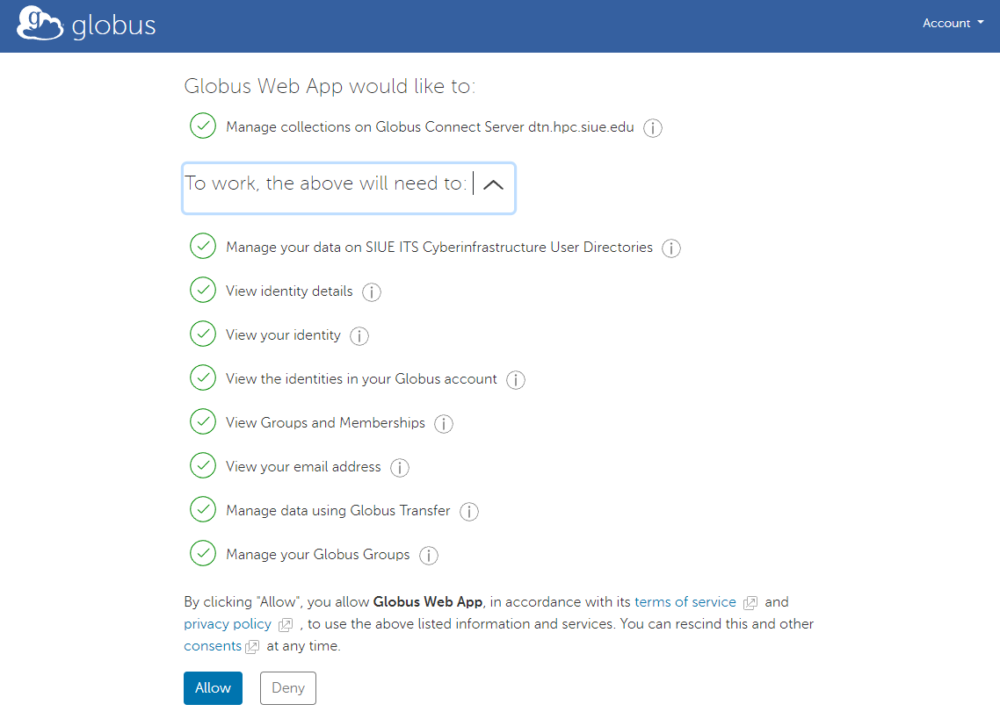

After allowing Globus these permissions, you will be taken back to the Endpoint's main page. Under the Credentials tab, you will now see your NetID listed with an **active** status.

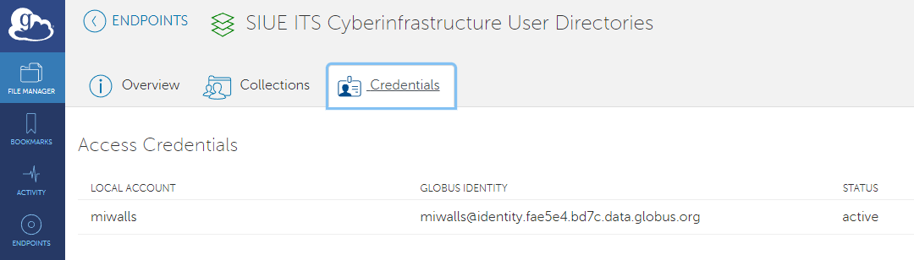

There is one final step for authenticating the Endpoint for file transfers. On the Endpoint's main page under the Overview tab, click **Open in File Manager**.

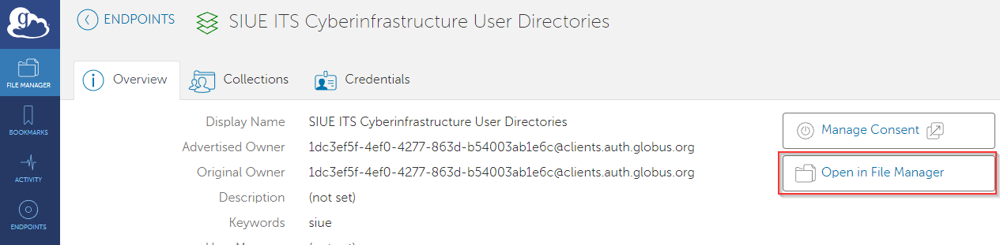

You will be taken to the File Manager page, but Globus requires one more authentication/consent. Click **Continue** to complete the final step.

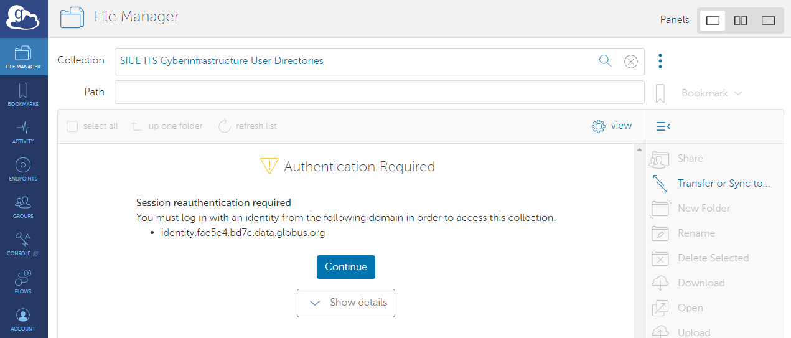

Select the identity created in the previous steps.

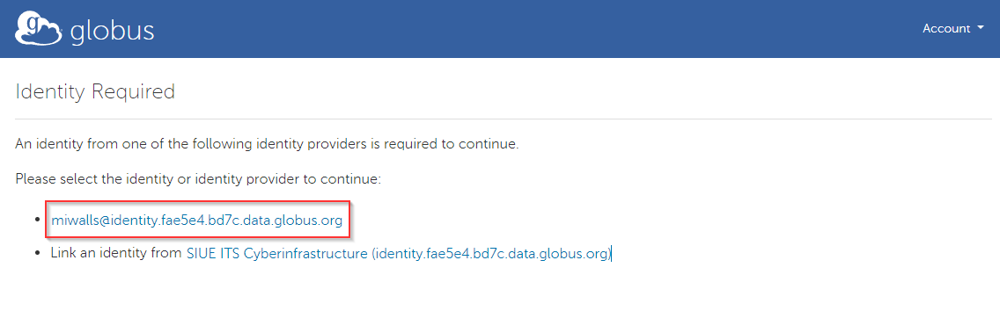

Login again to the DTN directly using SIUE e-ID and password.

Click **Allow** to grant Globus the permissions.

You will be taken back to the File Manager page, where you should see `/home`, `/project`, and `/bulk` directories, which looks something like the following:

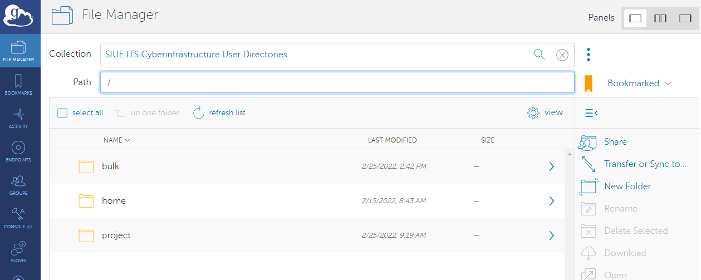

### Transferring files

The File Manager page is the page you'll use for your file transfers, and it has a two-pane bi-directional layout.

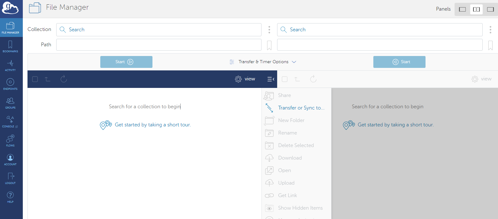

?> Tip: You can toggle the number and configuration of the two panes using the Panels menu in the top right of the File Manager page.

In the **Collection** field at the top of either column, you can search for **SIUE ITS Cyberinfrastructure** to access your SIUE directories. By default, you will be in your `/home` directory. You can navigate to other directories (`/project` and `/bulk`) by typing their paths in the **Path** field, or you can enter `/` to view all directories.

?> Tip: Your project and bulk directory paths are of the form `/project/<PI_username>_<id>` and `/bulk/<PI_username>_<id>`.

In the other column, you can click the Collection field and navigate to the **Your Collections** tab, where you'll find your personal computer's Collection you set up.

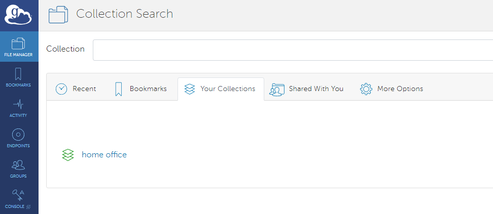

After selecting the two Collections and navigating to the desired directories, your File Manager page will look something like this:

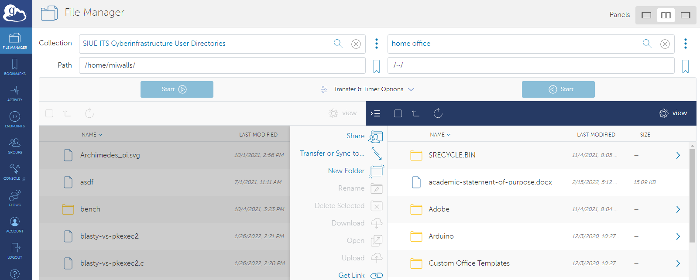

This user wants to transfer files from the `academic-statement-of-purpose.docx` file on their computer to their SIUE `/home` directory.

To begin the transfer, highlight one or more of the files in your local folder. Starting the transfer is as simple as clicking the blue **Start** button.

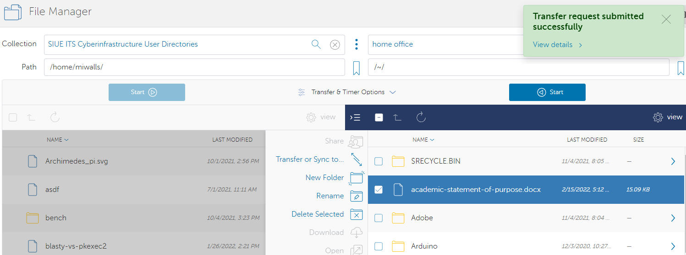

A popup window will appear in the upper right notifying you that the transfer was submitted and giving you the option to **View details**. That will take you to a screen where you can watch the progress, as well as view other information about your transfer job. If your files are large, Globus takes a few seconds or minutes to index them and get ready to transfer.

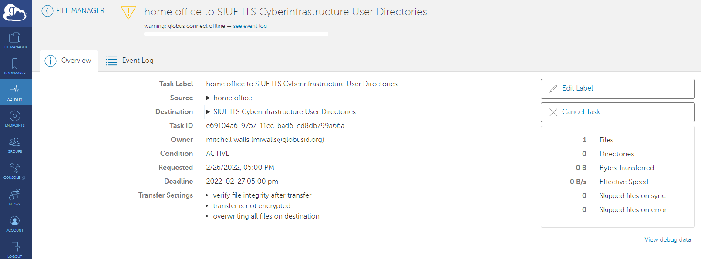

You'll also receive an email notifying you of the file transfer success (or failure). Make a note of the Task ID in case your transfer fails and you need to restart it.

When your transfer completes, go back to the File Manager window. In the SIUE directory column, click the refresh button in the middle menu (right under the Path field). The refresh button is the right-curling arrow, which will pull an updated listing of the files in your SIUE directory (in this case, the `/home` directory). If needed, scroll through the list and you will see your files there.

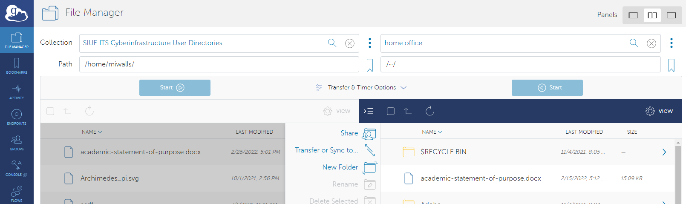

?> Tip: You don't have to transfer files one-by-one. By highlighting a folder and clicking the **Start** button, you can move the folder and all its contents to SIUE directories.

The two-column bi-directional layout of the file manager should suggest to you that to download files from the data transfer node, you merely need to highlight them in the SIUE column (rather than the column for your personal computer) and then click the **Start** button.

#### Syncing directories

Globus offers settings that can be applied to your transfer to synchronize your two directories. Syncing directories prevents the same files from being transferred repeatedly, saving you transfer time.

To synchronize your local directory and your SIUE directory, access the Transfer & Sync Options menu located in between the two transfer columns. Select the "sync - only transfer new or changed files where the checksum is different" checkbox, and click the blue "Start" button to start your transfer.

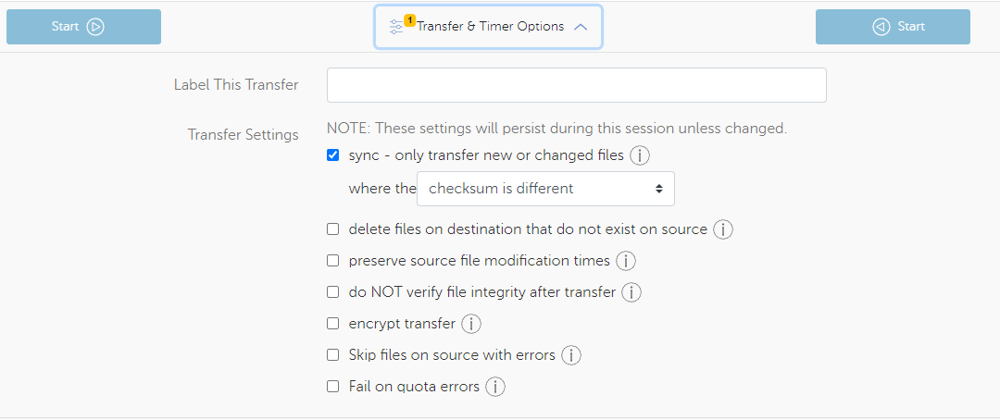

There is also an option to delete files in the destination directory if they aren't in the source directory, as well as options to preserve source file modification times and encrypt the file transfer.

### Restarting file transfers

If your transfer fails, you should first look at the last few events in the event log to identify any problems needing human intervention (quota exceeded, out-of-disk space, etc.). You can view event logs for transfers by navigating to the **Activity** tab on the left-hand menu, selecting the transfer in question, and navigating to the transfer's Event Log tab.

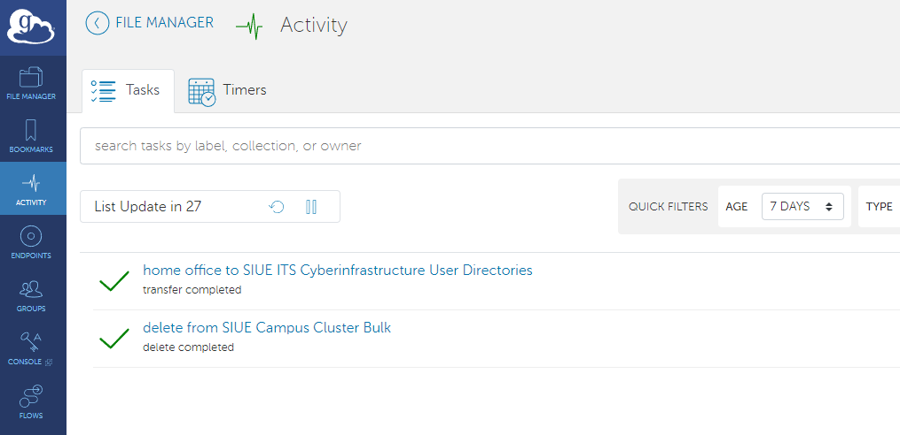

Note: This transfer was successful, but a failed transfer is accessed in the same way.

After fixing the issue that caused the transfer to fail, you can resubmit the transfer in the same way as you did originally, making sure to synchronize the two directories to avoid re-transferring other files (see the "Syncing directories" section above).

### Using bookmarks

The Globus File Manager offers a bookmark feature to access your most-used directories easily. You can add a bookmark to a directory by clicking the bookmark ribbon next to the Path field in either column.

You can view and manage your Bookmarks when searching for a Collection, under the Bookmarks tab.

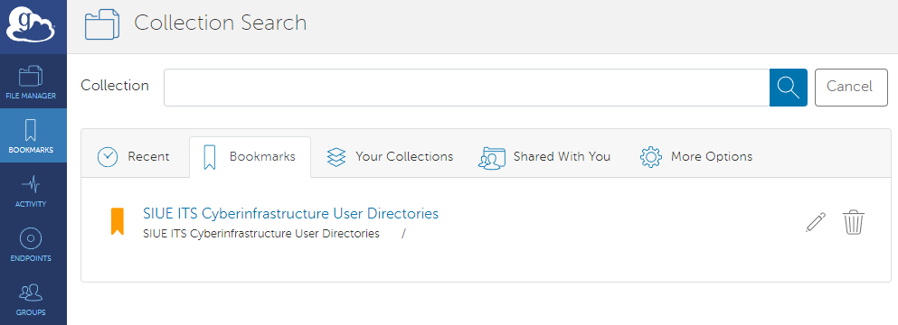

### Using the Globus CLI

Globus also provides a command-line interface (globus-cli) that you can install; for more information, see the guide for [Globus CLI](https://docs.globus.org/cli/).

### Helpful tips

* SIUE file systems are Linux-based. That means file and folder names are case sensitive and spaces and strange characters are awkward. Do not use characters like slashes and dollar signs in your file names if you are planning to upload them to SIUE systems. Replacing spaces in file and folder names with an underscore or dash is recommended.
* Globus is capable of transferring a lot of small files, but in many cases you will get faster transfers and better results by creating a .tar, .gzip, or .zip file before trying to transfer data to or from SIUE systems.
