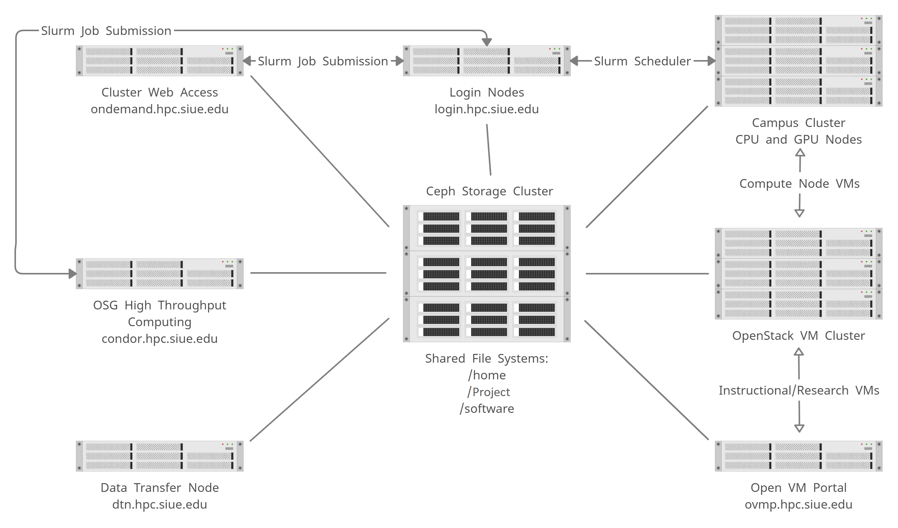

# Getting Started
This guide will help you get started with the SIUE's campus computing cluster by instructing you on how to connect, log in, transfer data, and run jobs.

An SIUE account is required to log in to and use SIUE resources.

### Overview
The campus cluster (CC) is the SIUE's general use high-performance computing cluster, which is a collection of computers and disk arrays that are connected via fast networks. CC allows SIUE researchers to perform computing tasks, like data analyses and simulations, on a larger scale than is possible with a laptop or lab computer.

The following graphic depicts the SIUE ITS cyberinfrastructure and how different systems interact with one another:



### Cyberinfrastructure overview

When using CC, you will notice several differences from your desktop or laptop environment:

* The interface is command-line driven (no graphical user interface with the exception of using VMs or OnDemand interactive desktop apps)
* CC uses the Ubuntu Linux operating system (not macOS or Windows)
* You submit your programs to a remote batch processing system, or job scheduler, to run them

### Workflow
The workflow for using CC typically consists of the following steps:

1. Logging in to the login node
2. Organizing files
3. Transferring files
4. Installing and running software
5. Testing your job interactively on a compute node
6. Submitting your job to the job scheduler to run it remotely on a compute node
7. Monitoring your job and checking the results when it has completed

### Logging in to the login node
To log in to the CC login node (also known as the head node), you will need to use a secure shell client. This is a small application that enables you to connect to a remote computer via SSH (Secure Shell), a cryptographic network protocol for securely operating network services. You will need your SIUE e-ID and password to SSH into the login node.

<details>
  <summary>
    <b>SSH login: macOS and Linux</b>
  </summary>

> macOS users can connect to CC using the Terminal application that is natively installed. Linux users can similarly use the natively installed terminal application that comes with their distribution of Linux (e.g., Terminal on Ubuntu).
>
> To connect, open a new terminal window and enter:
>
> ```ssh <username>@login.hpc.siue.edu```
>
> Be sure to substitute your SIUE e-ID as the username. This is the same username for your SIUE email account (e.g., cougar@siue.edu's e-ID is cougar). After entering the command, you will then be prompted to enter your SIUE e-ID password. This is the same password for your SIUE email account.
>
> - Note: There will be no visual feedback as you enter your password. This is a security feature designed to obscure your password and is expected.

</details>

<details>
  <summary>
    <b>SSH login: Window</b>
  </summary>

> Windows users may need to download and install a third-party SSH client to connect to CC. A popular client is PuTTY, which is available through the [developer’s website](https://www.chiark.greenend.org.uk/~sgtatham/putty/latest.html). Another popular option is MobaXterm, which also provides file transfer capabilities. It is also available through the [developer's website](https://mobaxterm.mobatek.net/download-home-edition.html). On Windows 10, there is a natively available Windows Terminal that has a [built-in SSH client](https://docs.microsoft.com/en-us/windows/terminal/tutorials/ssh).
>
> To connect using Windows Terminal, open a new terminal window and enter:
>
> ```ssh <username>@login.hpc.siue.edu```
>
> Make sure to substitute your SIUE e-ID as the username. You will then be prompted to enter your SIUE e-ID password.
>
> To connect using Putty, start in the Configuration window under the Session category and enter `login.hpc.siue.edu` as the hostname with port 22 and select Connection type: SSH. Then select Open to open a connection window, enter your SIUE e-ID as the username, and finally enter your SIUE e-ID password.
>
> Your SIUE e-ID is the same username for your SIUE email account (e.g., cougar@siue.edu's e-ID is cougar). Your SIUE e-ID password is the same password for your SIUE email account.
>
> - Note: There will be no visual feedback as you enter your password. This is a security feature designed to obscure your password and is expected.
>
> There are two ways to connect using MobaXterm. If you prefer the command-line interface, select "Start local terminal" and follow the instructions above using the Windows Terminal. If you prefer a GUI interface, select the icon "Session" on the top left corner (or, Sessions > New Session from the menu at the very top of the window). When prompted to choose a session type, choose "SSH." Under "Basic SSH Settings" enter login.hpc.siue.edu as "Remote Host" and enter your SIUE e-ID as the username after checking "Specify Username". Keep the port as 22. There are additional settings below that you may want to adjust as necessary, particularly the Bookmark settings if you want a shortcut. Click OK to open your SSH session. Enter your SIUE e-ID password when prompted for a password.
>
> If you are having issues with the MobaXterm SSH session disconnecting due to timeout/inactivity, click the "Settings" icon from the top menu. Then click to the SSH tab and under "SSH Settings" make sure to check "SSH keepalive" and then click OK. Restart MobaXterm and try again.

</details>

You can find instructions for setting up SSH keys for faster login at [setup SSH keys](user_guides/setup-ssh-keys.md).

If you are having difficulty using your SIUE e-ID and/or password, please contact help@siue.edu.

!>  Note: The login node is a shared resource that is used by many users simultaneously. Be careful not to do tasks on the login node that will negatively impact other users, or we may terminate your process without warning. You may run small tests on the login node, but beyond that you should use the compute nodes.

### Organizing files
**File systems**  
There are three directories where SIUE users can store files and run programs: home, project, and scratch.

<details>
  <summary>
    <b>Home directory</b>
  </summary>

> Your home directory has a default quota of 10 GB of disk space and 100 thousand files, and it is intended for personal configurations and settings as well as software installations. It is not intended for IO-intensive jobs to be run directly from /home.
>
> When you log in to CC, you will always start in your home directory. It will be of the form:
>
>```/home/<e-ID>```
>
> To easily switch to your home directory, enter the command `cd` from the directory you're in.
>
>We keep one week of daily snapshots for /home. You can think of these snapshots as semi-backups, meaning that if you accidentally deleted some data we would be able to recover it within one week. If the file was created and deleted within a one-day period, then the snapshot might not be recoverable. You should always keep extra backups of your important data and other files because of this.

</details>
<details>
  <summary>
    <b>Project file system</b>
  </summary>

> Project directories are by request only. To request a project directory contact its-cluster-support@siue.edu.
>
>
> Each project member has access to their project's directory, where they can store data, scripts, and related files. The project file system should be used for most of your SIUE work, It's also where you can collaborate with your research project. Users can be affiliated and have access to multiple project directories.
>
> A project directory can be located by typing:
>
> ```/project/<project_name>```
>
> `<project_name>` is the unique name requested by the owner.

</details>

<details>
  <summary>
    <b>Scratch file system</b>
  </summary>

> Every compute node has a /scratch directory which is **not** shared. They are unique and local only to the compute nodes. Any files older than a week are automatically deleted.
>
> The scratch directory is useful for jobs that require temporary files or high disk IO where a network storage would result in a significant slowdown.
>
> You can create any directory name in the /scratch directory:
>
> ```mkdir /scratch/<e-ID>```
>
> `/scratch` has a capacity of 500GB to 1TB depending on the node. These directories should only be used for temporary files that are dependent on a currently running job.
>
> ?> Note: The login node does not have a `/scratch` directory.

</details>

### Transferring files
SIUE has a dedicated data transfer node at `dtn.hpc.siue.edu`.The DTN is configured for fast file transfers. The node is a [Globus endpoints](user_guides/transfer-files-globus.md). To access these nodes, use `@dtn.hpc.siue.edu` instead of the normal login node (`@login.hpc.siue.edu`) when logging in:

`ssh <username>@dtn.hpc.siue.edu`  

Remember to always transfer files into your home or project directories where you have sufficient disk space.

For more information on transferring files between your local machine and the CC cluster, see the [Data Management and File Transfers](user_guides/data-management.md) user guides.

**Between your local machine and CC**  
There are a number of ways to transfer files between your local machine and CC. These include the commands `sftp`, `scp`, or `rsync` as well as GUI apps like [Cyberduck](https://cyberduck.io/) or [FileZilla](https://filezilla-project.org/).

**From the web to CC**
You can transfer a file from the public Internet directly to one of your directories on CC by using the commands `wget` or `curl` or, for Git repositories, `git clone`.

Helpful links:

- [GNU Wget](https://www.gnu.org/software/wget/)
- [curl](https://curl.haxx.se/docs/manpage.html)
- [git clone](https://git-scm.com/docs/git-clone)

### Creating and editing files
You can always create files on your personal computer and transfer them to CC, but sometimes it is easier to create them directly on CC. For plain-text files, you can use the `nano`, `micro`, `vim`, or `emacs` text editors. We recommend the micro editor for new users; Vim and Emacs both have steeper learning curves, but you may eventually find them more useful and productive.

Links to text editors' webpages:

- [Nano](https://www.nano-editor.org/)
- [Micro](https://micro-editor.github.io/)
- [Vim](https://www.vim.org/)
- [Emacs](https://www.gnu.org/software/emacs/)

To create a new file, simply enter the editor name as the command (e.g., `micro`). You can specify the filename when saving the file.

To edit an existing file, enter the editor name as the command and then the path to the file as the argument (e.g., `micro script.R`).

### Installing and running software
Once you are logged in, you can use software, work with files, run brief tests, or submit Slurm job scripts to the job queue.

!>  Note: The login node is a shared resource that is used by many users simultaneously. Be careful not to do tasks on the login node that will negatively impact other users, or we may terminate your process without warning. You may run small tests on the login node, but beyond that you should use the compute nodes.

<details>
  <summary>
    <b>Using SIUE-installed software</b>
  </summary>

> On CC, SIUE maintains software, compilers, and libraries using the `module` system. These may satisfy your computing requirements without any further installations.
>
> To see the list of available software, enter the command:
>
> ```module avail```
>
> To load software based on this list, such as Conda, enter the command:
>
> ```module load anaconda3```
>
> This loads the default version of Python. Then, for example, enter `python` to begin an interactive Python session.
>
> For more information on the software module system, see our [Software Module System user guide](user_guides/software-and-programming.md).

</details>

<details>
  <summary>
    <b>Installing your own software</b>
  </summary>

> Researchers are encouraged to install any software, libraries, and packages necessary for their work. Consult the software's documentation on how to install from source or with pre-built binaries. Additionally, for a more controlled and portable computing environment, consider using a [Singularity container](https://singularity.hpcng.org/user-docs/master/) for your software builds.
>
> For more information on installing software, see the [Software and Programming user guides](user_guides/software-and-programming.md).

</details>


### Jobs
A job consists of all the data, commands, scripts, and programs that will be used to obtain results.

<details>
  <summary>
    <b>Running your job</b>
  </summary>

> Because the CC computing cluster is a shared system, we use a job scheduler to manage all requests for resources. The Slurm (Simple Linux Utility for Resource Management) job scheduler is an open-source job scheduler that allocates compute resources on clusters for queued, user-defined jobs. It performs the following functions:
>
> - Schedules user-submitted jobs
> - Allocates user-requested computing resources
> - Processes user-submitted jobs
>
>For more information on creating and submitting Slurm job scripts, see the [Running Jobs](user_guides/running-jobs.md) user guide. A listing of common Slurm commands can be found [here](https://slurm.schedmd.com/pdfs/summary.pdf).
>
> The compute resources on CC are shared across many projects and users. When a user submits a job with Slurm, resources are divided using a fair share algorithm.

</details>
<details>
  <summary>
    <b>Testing your job</b>
  </summary>

> We recommend that you first test your job interactively on a compute node before submitting it remotely to the Slurm job scheduler, ensuring that you will have quality results after the job completes. You can do this by requesting an interactive session with a compute node using the `salloc` command.
>
> For example, to request four processors for one hour, enter:
>
> ```salloc --ntasks=4 --time=1:00:00 --account=<account_id>```
>
> Be sure to use the correct account for your jobs. Without the `--account` option, your default account will be used. This is fine if you only have one project account.
>
> After running the command, the job scheduler will add your job to the wait queue.
>
> Once your job starts, you can then test out your scripts and programs to make sure they work properly. Once you are confident that you know how your program will behave, you are ready to submit a job through Slurm.

</details>

<details>
  <summary>
    <b>Submitting your job</b>
  </summary>

> After you have tested your job interactively and achieved the results you want, you can now submit your job to Slurm.
>
> To submit a job, first create a Slurm job script using one of the previously mentioned text editors.
>
> Your job script should look something like this:
>
> ```
> #!/bin/bash
> #SBATCH --ntasks=1
> #SBATCH --cpus-per-task=2
> #SBATCH --mem-per-cpu=1GB
> #SBATCH --time=1:00:00
> #SBATCH --account=<account_id>
>
> module load anaconda3
> python3 script.py
> ```
>
> The top few lines of the file (that begin with `#SBATCH`) use options to specify the requested resources for your program. Be sure to use the correct account in your job scripts. Without the `--account` option, your default account will be used. This is fine if you only have one project account.
>
> The next set of lines loads the required software modules (`module load ...``). After that, the remaining lines are commands that run your programs.
>
> To submit a job, enter the command:
>
> ```sbatch my.job```
>
> where the argument to the command is the job script's file name (e.g., `my.job`).
>
> Submitted jobs are processed remotely. The process is recorded and written to an output file in the same directory that your job script is stored in. By default, this output file is named `slurm-<jobid>.out`. This is a plain-text file, so you can view it using the `less` command:
>
> `less slurm-<jobid>.out`
>
> For more information on creating and submitting Slurm job scripts, see the [Running Jobs user guide](running-jobs.md).
>

</details>

<details>
  <summary>
    <b>Monitoring your job</b>
  </summary>

> There are several commands you can use to monitor a job after it has been submitted.
>
> The first thing you will want to check is if your job request was queued. Use the `squeue` command to view the status of your jobs, replacing `<username>` with your SIUE e-ID:
>
> `squeue -u <username>`
>
> Each job is assigned a unique job identifier. It is sufficient to use only the numeric portion of the job ID when referencing a job or submitting a ticket.
>
> In the example below, the job 3271 has been placed in the "main" partition (PARTITION) based on its requested time of 1 hour:
>
> ```
> squeue -u ttrojan
> JOBID PARTITION     NAME     USER ST       TIME  NODES NODELIST(REASON)
> 3271      main   my.job    cougar  R      35:58      1 cc-cpu-01
> ```
>
> The job has been running for 35 minutes and 58 seconds (TIME). It has requested 4 tasks and was allocated 1 node (NODES), which is cc-cpu-01 (NODELIST). The status of the job is "R" (running) (ST).
>
> You can also use the `squeue` command to estimate when your job will start:
>
> `squeue --start -j <jobid>`
>
> If you wish to cancel and remove your job from the queue, you can use the `scancel` command:
>
> `scancel <jobid>`
>Your job may remain in the queue for a short time, but its status will change to "CG" (completing) or "CA" (canceled).

</details>

### Getting help
If you need additional assistance getting started with the CC, please contact its-cluster-support@siue.edu.
