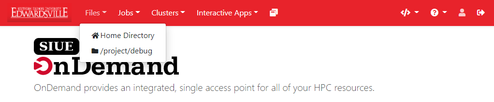
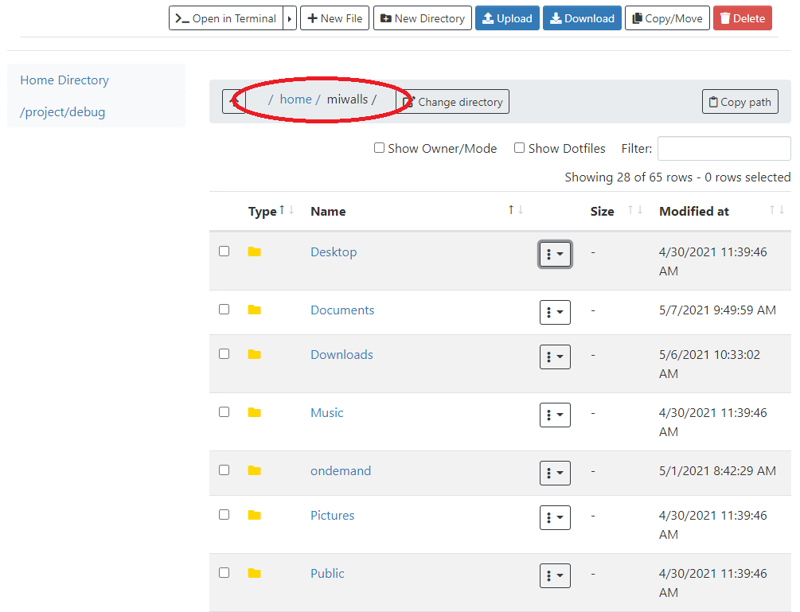
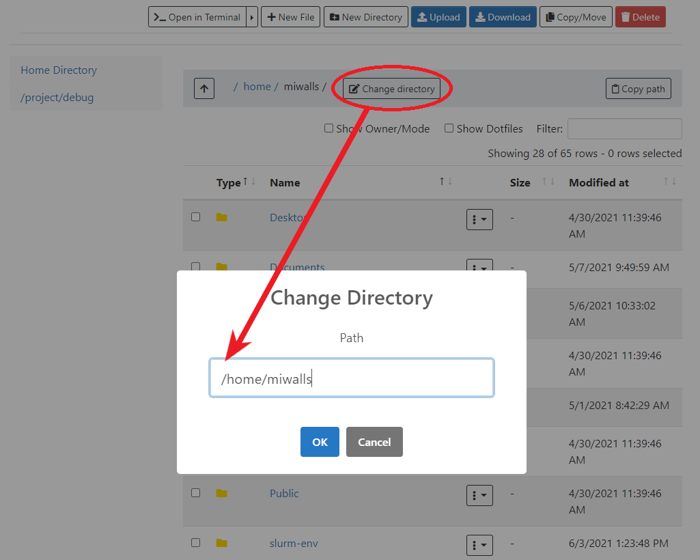
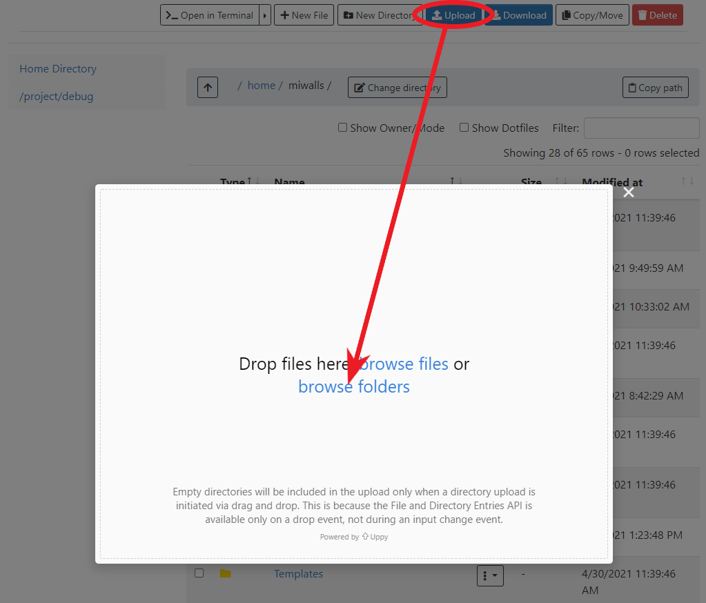
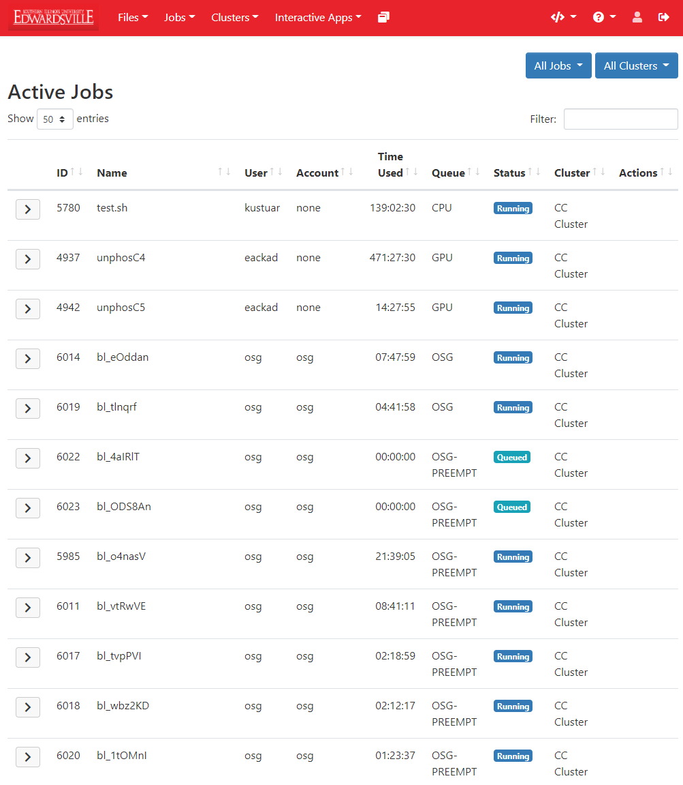
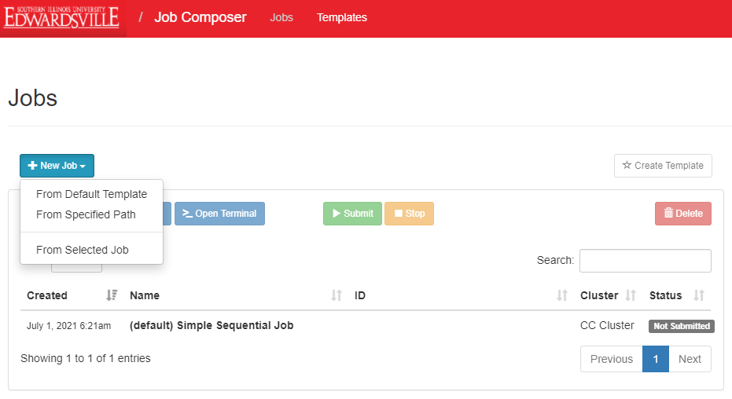
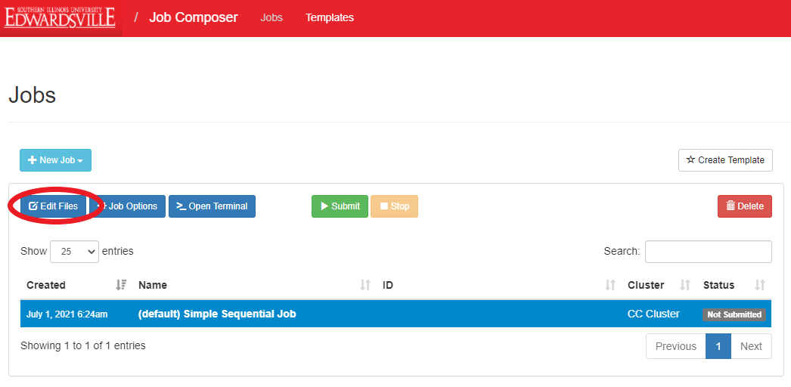
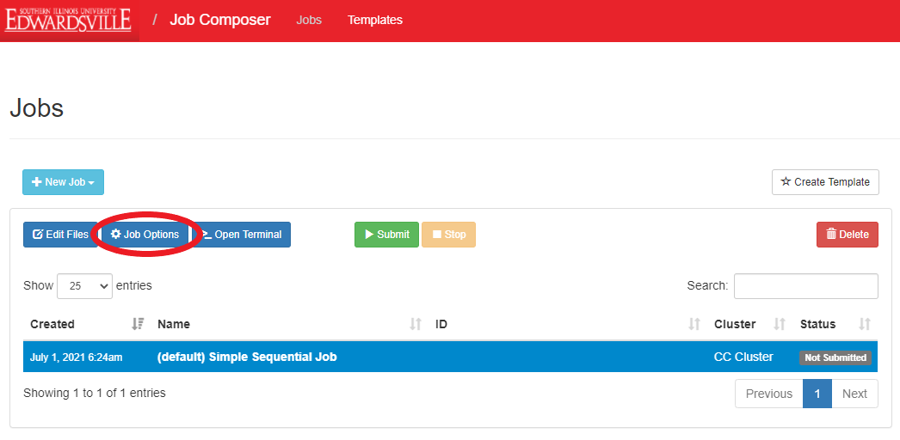
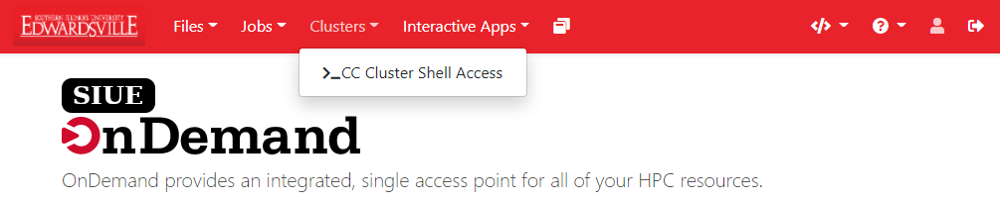

# Getting Started OnDemand

The OnDemand service is an online access point that provides users with web access to their SIUE `/home`, `/project`, and `/bulk` directories and to the campus cluster.

> OnDemand offers:
> - Easy file management
> - Command line shell access
> - Slurm job management
> - Interactive Apps (i.e. Matlab, Jupyter...)

OnDemand is available to all SIUE users. To access OnDemand, you must belong to an active project in the campus cluster.

[Log in to SIUE OnDemand](https://ondemand.hpc.siue.edu)

### Files
OnDemand provides a web-based File Explorer that can be used to upload, download, copy, delete, rename, and edit files.

>OnDemand has quick links to your:
> - home directory
> - project directories
> - bulk directories

Every user will have access to their `/home`, `/bulk`, and `/project` directories. If you have access to a project space in a project or bulk directory, you will also have access to this directory. The project or bulks directory's name will be of the form `/project/<PI_e-ID>_<project_id>` or `/project/<PI_e-ID>_<project_id>`. You can view your current projects by typing the `projects` on the login or compute nodes.

You can access the File Explorer from the main OnDemand dashboard. Select the file system you would like to access:

After selecting a directory (in this case, the user's home directory), OnDemand will present a graphical representation of the directory and all its contents:

#### Navigation
From your selected directory, you can switch to another by backtracking through the path near the top of the window and selecting the previous directory you wish to browse:

In addition, you can use the "Change Directory" option in the top menu to type the path you wish to navigate to:

On the left side of the screen is a tree view of the directory structure. You can navigate this tree the same way you might on a normal desktop GUI to select the folder you wish to use.

#### Uploading and downloading files
There are several ways to upload files. The first is to simply navigate to the desired destination directory in OnDemand, and then drag the file or directory from your local computer to the OnDemand browser window. You can also click the "Upload" button to open a dialog that will allow you to navigate your local computer and select which files you want to upload:

 You can also click the "Upload" button to open a dialog that will allow you to navigate your local computer and select which directories you want to upload:

To download files, select the file(s) in the OnDemand directory that you wish to download, and then use the "Download" button. If you select multiple files ("control+click" or "shift+click") or a folder, OnDemand will zip the files and download a single zip archive to your computer.

#### File operations

Most file operations can be accomplished by selecting a file in the File Explorer and choosing the desired operation from the main menu:

> You have the ability to perform the following file operations in OnDemand:
>
> - Open in Terminal (go directly to the directory containing the file in the web terminal shell)
> - New File (create a new blank file)
> - New Directory (create a new empty directory)
> - Upload (upload a file form your local computer)
> - Download (check box of file to download before clicking)
> - Copy/Move (used to rename and copy files)
> - Delete (deletes file permanently **be careful**)

### Jobs
OnDemand provides two related job management tools. The Active Jobs tool allows you to monitor queued and running jobs and the Job Composer tool allows you to create and submit jobs via your web browser.

#### Active Jobs
The "Active Jobs" tool will show you all jobs currently in the queue (running or queued), regardless of how the jobs were submitted:

You can use the dropdown options at the top of the page to toggle between your jobs, all jobs, and the different clusters. The screenshot above shows all jobs clusters. You can also use the "Filter" tool to filter jobs based on systems campus cluster, status (running, queued, or hold), user, project account, etc.

If you click the arrow to the left of each job entry, you can get more information about the job, including information about the node(s) on which the job is running.

#### Job Composer
Selecting Job Composer in the Jobs menu will open the Jobs page, where you can create new jobs and submit them to the cluster, and inspect the results of jobs submitted via this tool.

To create a new job, from the Jobs page, click the "+New Job" button:

There are four ways to create a job:

- "From Default Template" creates a Simple Sequential Job (the default job template)
- "From Specified Path" creates a new job based on the source path to a directory on the campus cluster
- "From Selected Job" creates a new job from a previously run job directory

For example, to create a new job from a job default template, select `New Job -> From Default Template`. then click the blue `Create New Job` button on the left hand side of the page:

From the table, select the job you just created, then modify and/or add any files to this job by clicking `Edit Files`

You will be taken to the File Explorer, where you can upload any files required for your job. See the "Files" section above for instructions on uploading files.

If you need to make changes to a job's settings, select the job and click "Job Options":

Here, you can change the job name, cluster, job script, project account, or job array specification:

After you've created your job, added files, and changed any settings as necessary, you can submit the job using the green "Submit" button from the Jobs page. You can also similarly use the yellow "Stop" button to stop a running job, or the red "Delete" button to delete a job from your list:

You can also monitor the job status on the Jobs page:

Currently, you must reload the page to see job status changes.

### Shell access

OnDemand provides the ability SSH into the [campus cluster](user_guides/hpc_basics/getting_started.md) from inside your web browser:

#### campus cluster

To access the campus cluster:

- Select `Clusters->Campus Cluster Shell Access` from the drop-down. You will see a password authentication prompt upon launching the shell:

Shell access will be connected to the campus cluster login node. For detailed information on the campus cluster, see the [Getting Started](user_guides/hpc_basicsgetting_started.md) user guide.

SIUE file systems (/home, /project) can be accessed using the OnDemand File Explorer - see the "[Files](#files)" section above.

### Interactive apps
The Interactive Apps section of OnDemand is a selection of apps that range from a complete desktop VNC session to a Jupyter Lab web browser session.

- [CC Cluster Desktop](user_guides/tutorials/desktop_environment.md)
- [MATLAB](user_guides/tutorials/interactive_matlab.md)
- [Jupyter](user_guides/tutorials/jupyter_lab.md)

### Additional information
- [OnDemand documentation](https://www.osc.edu/resources/online_portals/ondemand)
