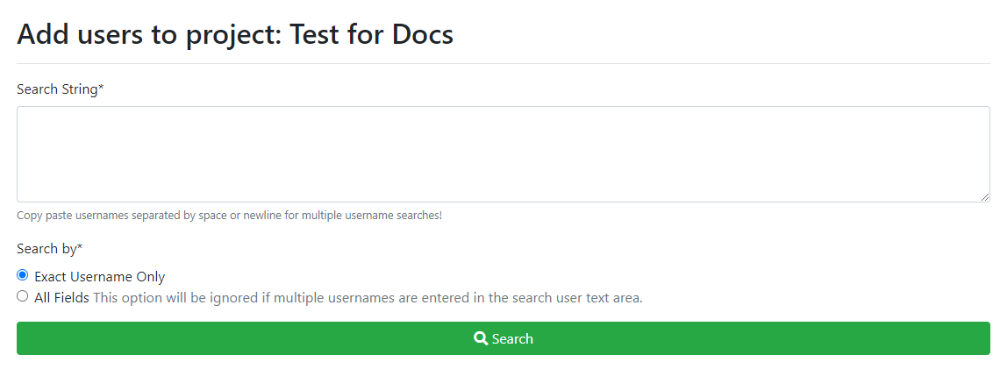
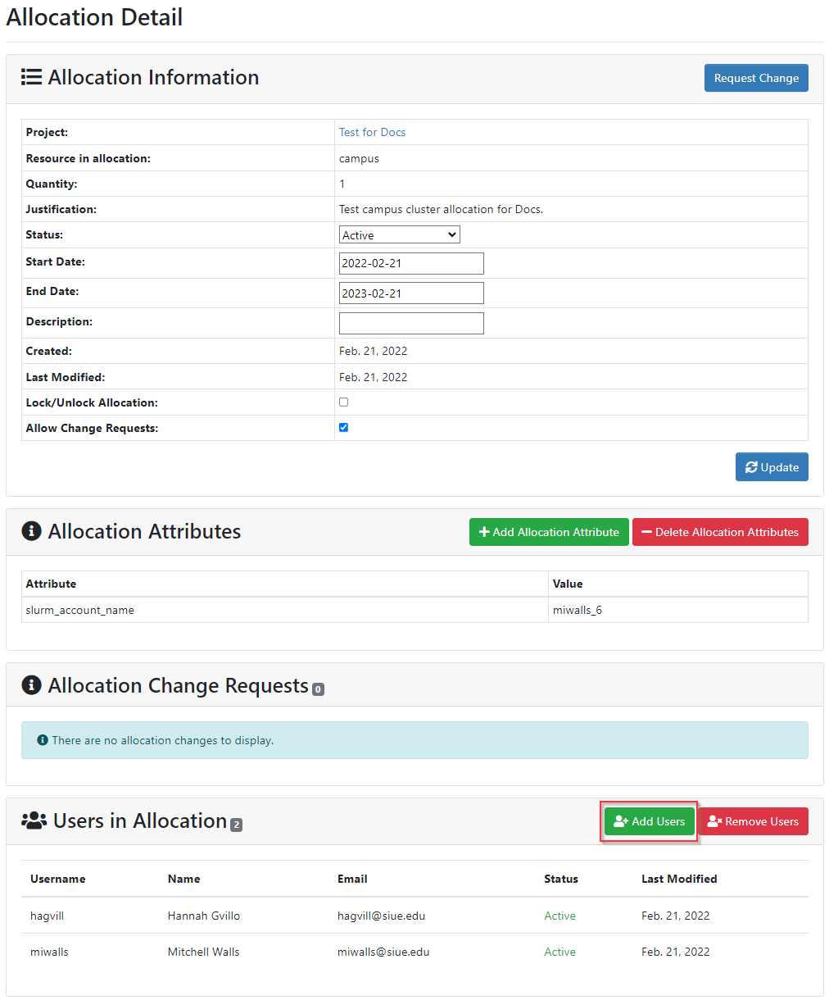

# Adding Users
If you have students or other collaborators who will be working on your research project with you, you have the option to add them as users to your projects and allocations.

> Note: To add a user to your project, they must be an active SIUE member. If you have a collaborator that you want to grant access to a project to, but they do not have a SIUE account, you must submit an Affiliate account request for an SIUE account for this collaborator, as only the SIUE Identity and Access Management department can create those accounts.

> Note: Adding users to Storage based resource allocations does nothing since any user in the project will have access to any storage resources by default.

### Searching for users

From the home page, click on the project that you want to add a user to.

On the Project Detail page, click "Add Users".

You will be sent to a page that allows you to search the SIUE's system by username.

> Note: The SIUE username is the first part of the user's SIUE email address (e.g., in user@siue.edu the username would be "user"). If you do not know the user's username, you can look it up on the [SIUE Online Directory](https://www.siue.edu/search/people.shtml).

You may enter a list of SIUE usernames in the box. You should put each username on a separate line or separate usernames by a space. After entering the username(s), click "Search".

If found in SIUE's system, the full names and email addresses of the users will be displayed. Select the checkbox next to the user(s) you'd like to add.

### Selecting allocations

Next, make sure the allocations, or "subscriptions", you want the user to have access to are selected. Selecting an allocation/subscription tells the system which resource (cluster and storage) to give the user access to. **If you do NOT select an allocation, the user will not be able to use any SIUE resources other than the user portal**.

### Changing user roles

At this point, you have the option of selecting a role for the user. The User role is selected by default, but you can also give a user Manager access to the project. You can return to the Project Detail page at any time to modify users' roles.

### Adding selected users

Click the "Add Selected Users to Project" button when done. You will see these users have been added to your project now:

Users must be added to a project to be added to that project's allocation. However, all users added to a project do not need to be added to every allocation held for that project.

> Note: You will see each user's status listed as "active" immediately after adding them to a project or allocation. However, SIUE staff need to modify user accounts to give them the access requested. This is usually done within 1 business day of adding the user account to a project/allocation.

### Allocation Detail page

You can see all users that have access to an allocation on the Allocation Detail page, which can be found by clicking the folder icon next to the allocation name:

If you'd like to add a user from your project to an allocation they don't currently have access to, you can do this from the Allocation Detail page:

Click the "Add Users" button. Any users in your project that do not already have access to this allocation will be listed and available to be added.
