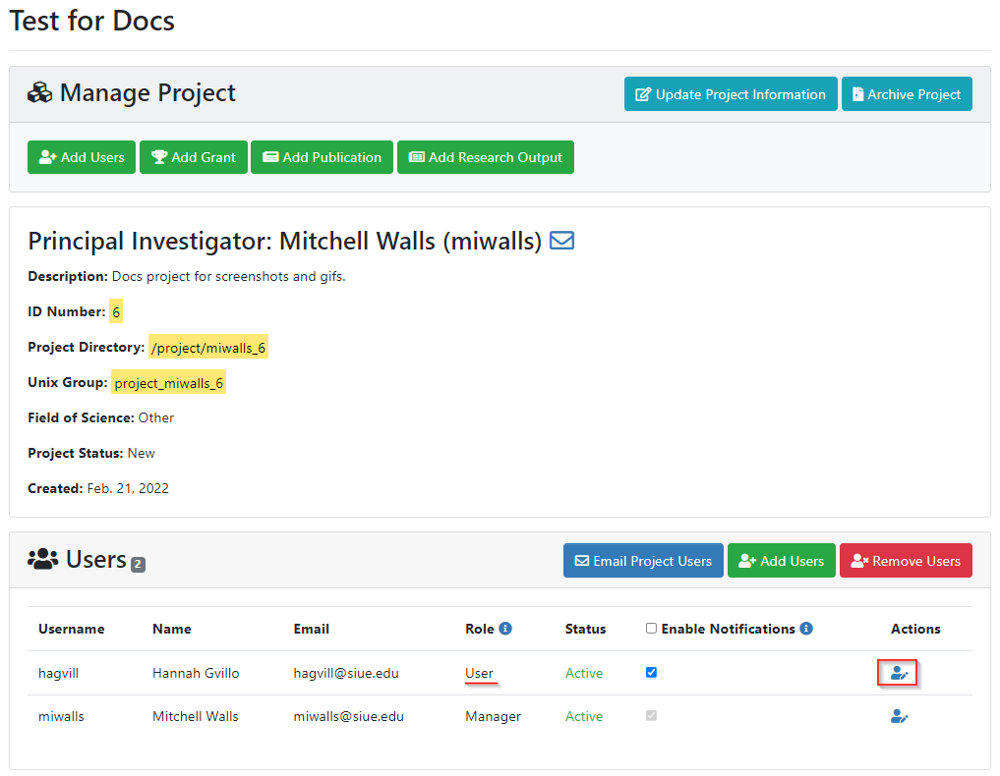
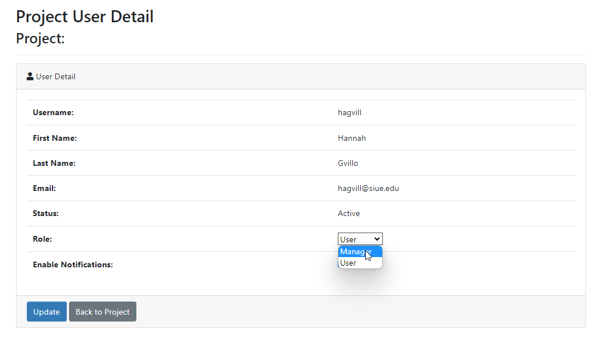

# Granting Manager Access

PIs can grant manager access to users on their projects to allow for a trusted graduate student or lab director to manage the user accounts and allocations on a project. This is done on a per-project basis, so you're able to allow a user to manage the project you're using for a course while still restricting access to other projects, such as your main research project.

### Granting manager access

To grant a user manager access, go to the Project Detail page for the project you'd like them to have access to.

Click on the edit icon next to their username under the Actions column:

Change the drop down option from User to Manager and click the Update button:

When you return to the Project Detail page for that project, you will now see that user listed as a manager:

When that user logs in to the User Portal, they will see your project and be able to add/remove users, request new allocations, and manage publications and grants.

### Removing manager access

If you want to remove this elevated access for a user, simply go to the Project Detail page and change the user's role from Manager to User in the drop down list.
