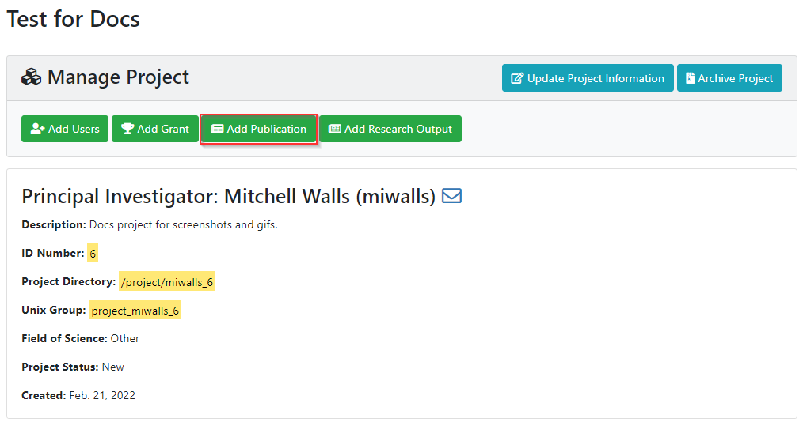
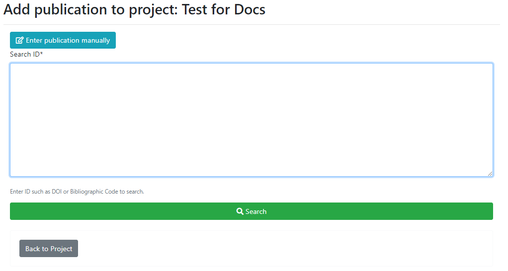
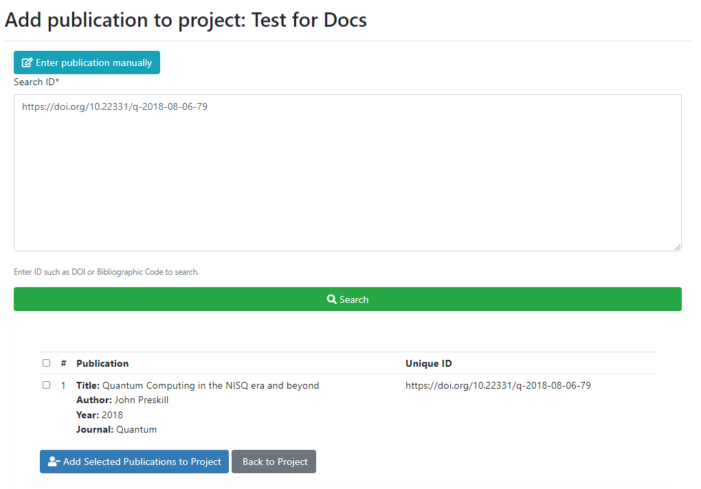

# Managing Publication Information

We ask faculty to upload their publication information to the user portal when the publication acknowledges SIUE or the information contained in it directly relates to work done on SIUE systems. You are encouraged to add all of your publications to the user portal.

### Adding publications

To add publications, click on the "Add Publication" button on the Project Detail page for your project:

You'll be presented with a box to enter a "Unique ID", which is the Digital Object Identifier (DOI) for your publication. Enter your full DOI and click the Search button:

If the search yields the correct result, click select the correct publication(s) then click "Add Selected Publications to Project" button:

You will then be redirected back to your Project Detail page where you'll see your publication listed. You will also see a label indicating the last time you updated publications on the project:

### Removing publications
You can delete a publication from your project by clicking the "Delete Publications" button on your Project Detail page. You will be presented with a list of all the publications on the project. You can select the one(s) you wish to delete and click the "Delete Selected Publications from Project" button:

