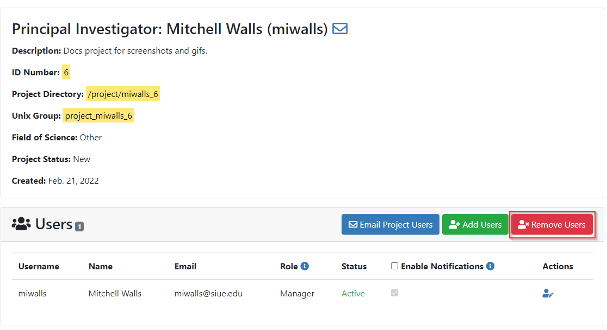
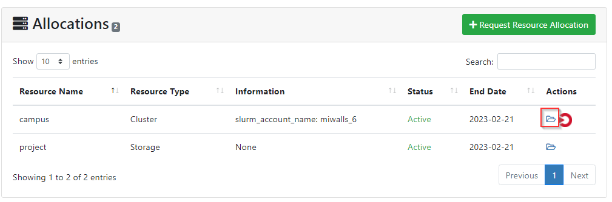
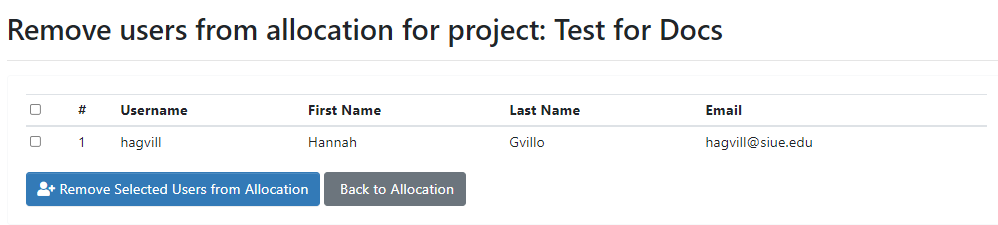

# Removing Users

PIs should remove users from their project and allocation(s) once they are done working together. This is an important step in ensuring your data is secure and accessed only by those you authorize.

### Deleting a user from a project

Most of the time, a student will graduate and no longer need a SIUE account. In this case, please remove the user from your project. To do this, log in to the user portal, click on your project, and click on the red "Remove Users" button in the Users section:

A list of all users on the project will be displayed and you can check the box next to each user you'd like to remove:

Once you click the "Delete" button, the user will be removed from your project view. SIUE will receive a notification that you'd like the account removed and we will deactivate it.

If you decide you'd like to add the user back to the project or that you made a mistake, just add them back to your project and allocation(s).

### Deleting a user from an allocation only

There are times when a faculty member has granted access to a user on an allocation for a private cluster or server. If you only want to remove the user from an allocation and not an entire project, click on the folder icon next to the allocation name to be taken to the Allocation Detail page:

Click the red "Remove Users" button:

You will then be shown a list of users with access to the allocation:

Check the box next to the user(s) you want removed from the allocation, then click the "Remove Selected Users from Allocation" button. Remember, this means the user no longer has access to THIS allocation but will still be included in your project and have an active account. If you have other allocations that the user has access to, they will still have access to those allocations.

Once you click the "Remove Selected Users from Allocation" button, the user will be removed from your Allocation Detail view. You will notice they are still listed as a user on your Project Detail page. If you want the user's account removed from your project completely, please remove the user's account from the entire project (see above).

SIUE will receive notification that you'd like the account allocation information updated and we will take care of it. Sometimes this involves changing access to Slurm associations so a user can no longer run jobs on a cluster, and sometimes it involves changing group access so a user can't log in to a private server anymore.

> NOTE: Please only remove a user from an allocation only (rather than from a project) if you don't want their entire account deactivated. Students who are no longer affiliated with SIUE or are no longer collaborating with you should be completely removed from your project(s) as well so that the SIUE knows to deactivate their account completely.
