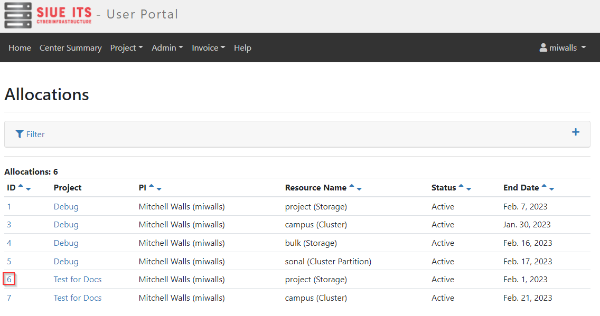

# Request Storage Increase

Managers of projects can request a storage increase by requesting an allocation change on the [User Portal](https://coldfront.hpc.siue.edu)

### Requesting an increase of storage allocations

View your current allocations at [User Portal Allocations](https://coldfront.hpc.siue.edu/allocation/) and click on the ID of the storage allocation that you would like to request an increase of GB or files number.

On the allocation detail page, click the "Request Change" button to go to the allocation change page.

On the change submit page, input the desired maximum GB and number of files. Provide a justification for the change so that we can verify the change is best for your current use case then click "Submit".

After submitting your change request, you will see that it was successfully submitted.

> Note: that the allocation storage quota attributes will not change until an admin approves the change request.

