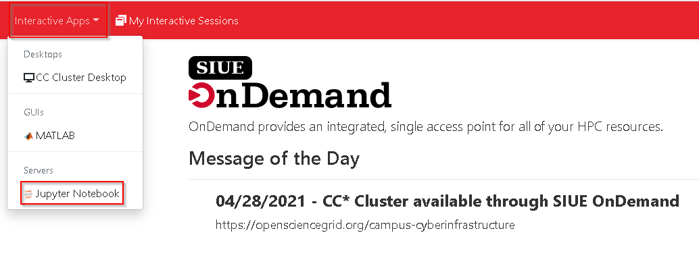
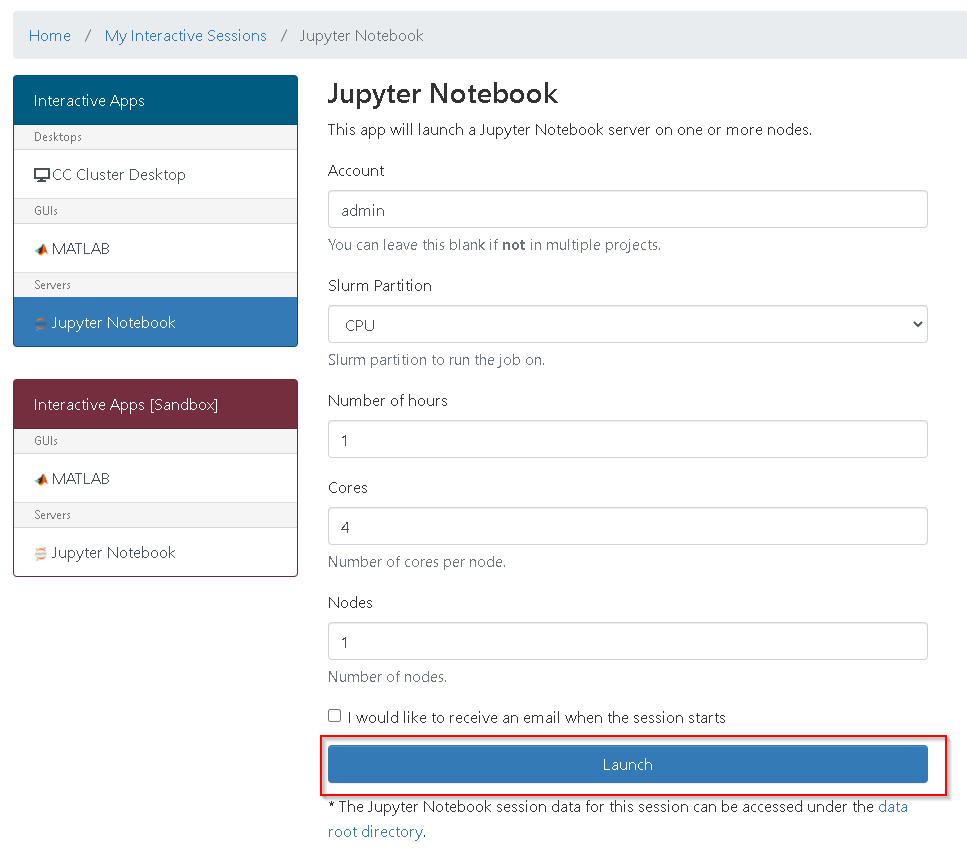

# Jupyter Lab

### Interactive App

#### Starting jupyter lab

Start a jupyter lab interactive app on the cluster.



Set all of the required fields typically, `Account` can be blank that way it uses your default account.
`Slurm Partition` is set to the type of node you would like to run this typically is set to `CPU`.
`Number of hours` should be set as accurately as possible that way if you forget to close Jupyter Lab it will free up the nodes.
`Cores` should be set to as many cores as needed typically this will be set to less than `32`.
`Nodes` should be set to `1` if you are testing or just getting started. Setting to two or more typically should only be ran as a direct Slurm batch job. Lastly click `Launch` to start the Jupyter Lab instance.




### User kernel

It is very typical that you will need a custom user kernel in order to install packages since the generic kernel ran by the Jupyter install is owned by the system and installing packages will result in a permission denied error. To circumvent this issue the following steps walk you through installing a virtual environment for python and configuring the new virtual environment as a Jupyter kernel.

#### Open a terminal

This can be done from any shell connected to the cluster as long as you are in your home directory. Below is an example of opening a terminal from within Jupyter Notebook


#### Create a user kernel

Inside the terminal run the following

?> Note: Change `myvenv` in the below commands to a more descriptive value if you are going to use many different virtual environments.

```
python -m venv myvenv
source myvenv/bin/activate
pip install ipykernel -q
python -m ipykernel install --user --name=myvenv
jupyter kernelspec list
```

Example of what you will see as the virtual environment is created and added to the Jupyter kernel list


#### Changing kernels

?> Note: Refresh the page in order for the newly created kernels to show up.


#### New file specific kernel

?> Note: Refresh the page in order for the newly created kernels to show up.

Create a new Jupyter file utilizing the new kernel you created in previous steps in this case called `myvenv`.


#### Installing packages from terminal

Open a terminal. This can also be done from any shell connected to the cluster just make sure to source the virtual environment before running pip.


In the terminal source your environment

?> Note: `{venv_name}` should be switched to what you have set for the target environment. In the case above it should be `myvenv`.

```
source {venv_name}/bin/activate
pip install {package}
```

Below is an example of the output seen by running the above for `myvenv`.


#### Installing packages from within a file

Simply type `pip install {package}` to install a package


