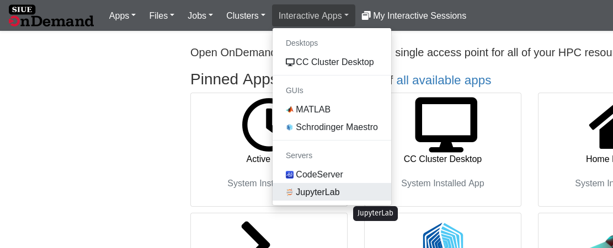
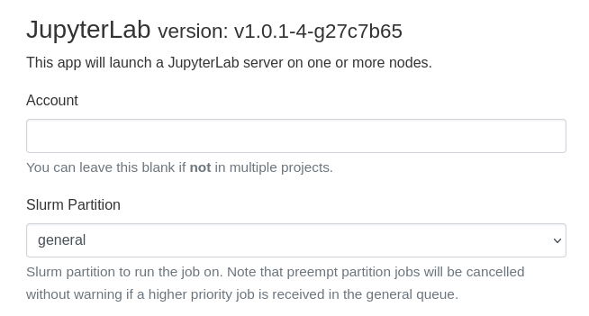
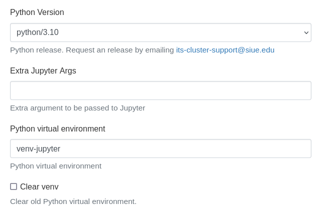
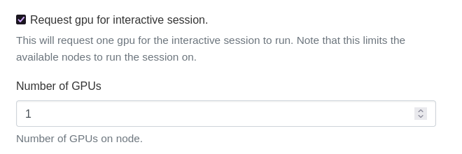
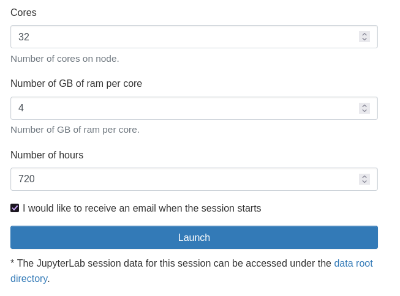
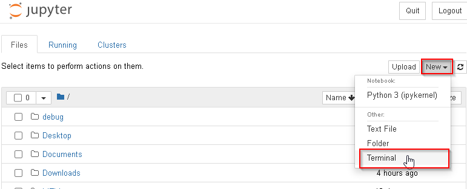
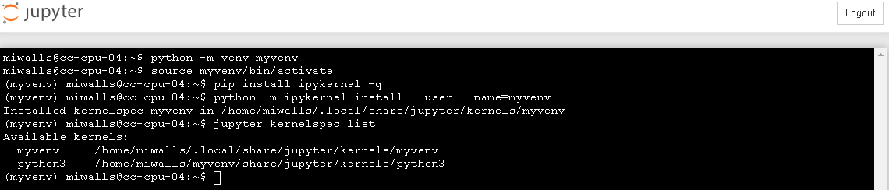
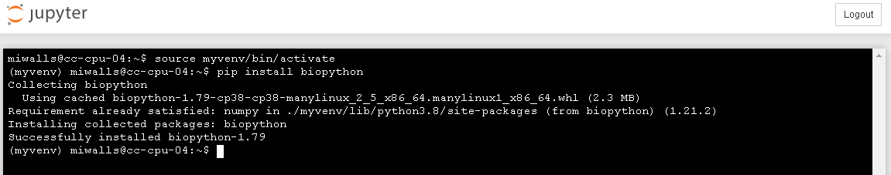

# Jupyter Lab

### Interactive App

#### Starting jupyter lab

Start a jupyter lab interactive app on the cluster.



**Partition:**  
You should now see the session request form. Begin by selecting the `Slurm Partition`.
`general` is the the common choose. Note if the preempt partition is selected jobs will be 
cancelled without warning if a higher priority job is received in the general queue. Then select 
the version of python (python/3.10) you would like to use.  



**Python:**  
You will then need to enter the name of the Python virtual environment (`venv`) you would like 
to use. If the venv doesn't exist a new venv will be created. If it does exist the OnDemand App 
will reinstall jupyter. The next option is `Clear venv` checkbox. This option with force the old 
venv to be deleted.  



**GPUs:**  
If you are planning on using libraries that utilize GPUs (like TensorFlow). Ensure 
that the "Request gpu" option is selected. Additionally, if you library or can utilize 
more than one GPU request 2 GPUs. Note that not all library can utilize both and selecting 
both can lead to longer queueing times.



**System Resource:**  
You can then select the number of cores needed and the amount of memory per core. 
In the screenshot we have 32 Cores * 4 GB per core for a total of 128 GB.  

Finally, enter the number of hours your would like the job to run and Launch  



**After Launch:**  
Your job may queue for a short time. 


Once it has finished queueing click the "Connect to Jupyter" button.


 <!--
### User kernel

It is very typical that you will need a custom user kernel in order to install packages since the generic kernel ran by the Jupyter install is owned by the system and installing packages will result in a permission denied error. To circumvent this issue the following steps walk you through installing a virtual environment for python and configuring the new virtual environment as a Jupyter kernel.

#### Open a terminal

This can be done from any shell connected to the cluster as long as you are in your home directory. Below is an example of opening a terminal from within Jupyter Notebook



#### Create a user kernel

Inside the terminal run the following

?> Note: Change `myvenv` in the below commands to a more descriptive value if you are going to use many different virtual environments.

```
python -m venv myvenv
source myvenv/bin/activate
pip install ipykernel -q
python -m ipykernel install --user --name=myvenv
jupyter kernelspec list
```

Example of what you will see as the virtual environment is created and added to the Jupyter kernel list



#### Changing kernels

?> Note: Refresh the page in order for the newly created kernels to show up.


#### New file specific kernel

?> Note: Refresh the page in order for the newly created kernels to show up.

Create a new Jupyter file utilizing the new kernel you created in previous steps in this case called `myvenv`.


#### Installing packages from terminal

Open a terminal. This can also be done from any shell connected to the cluster just make sure to source the virtual environment before running pip.


In the terminal source your environment

?> Note: `{venv_name}` should be switched to what you have set for the target environment. In the case above it should be `myvenv`.

```
source {venv_name}/bin/activate
pip install {package}
```

Below is an example of the output seen by running the above for `myvenv`.




#### Installing packages from within a file

Simply type `pip install {package}` to install a package


-->
